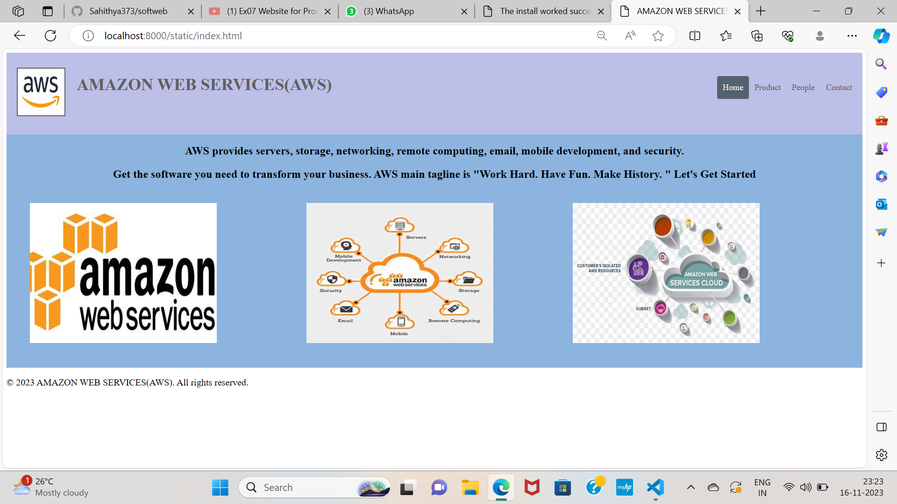

# Ex-07 Software Product Company Website
## Date: 31/10/2023

## AIM:
To develop a static company website to display the softwares and services provided by the company.

## DESIGN STEPS:

### Step 1:
Requirement collection.

### Step 2:
Creating the layout using HTML and CSS.

### Step 3:
Updating the sample content.

### Step 4:
Choose the appropriate style and color scheme.

### Step 5:
Validate the layout in various browsers.

### Step 6:
Validate the HTML code.

### Step 7:
Publish the website in the given URL.

## PROGRAM:
# index.html
```
<!DOCTYPE html>
<html lang="en">
<head>
    <meta charset="UTF-8">
    <meta name="viewport" content="width=device-width, initial-scale=1.0">
    <title>AMAZON WEB SERVICES(AWS) </title>
    <style>
        *{
            font-family: 'times new roman', 'times new roman', 'times new roman', 'times new roman', times new roman, times new roman;
        }

        .logo img{
            height: 100px;
            width: 100px;
        }
        header {
        overflow: hidden;
        background-color: #bcbfe7;
        padding: 20px 10px;
        }

        header a {
        float: left;
        color: rgb(97, 95, 95);
        text-align: center;
        padding: 12px;
        text-decoration: none;
        font-size: 18px; 
        line-height: 25px;
        border-radius: 4px;
        }

        header a.logo {
        font-size: 25px;
        font-weight: bold;
        }

        header a:hover {
        background-color: #968888;
        color: black;
        }

        header a.active {
        background-color: rgb(84, 98, 111);
        color: white;
        }

        .header-right {
        float: right;
        padding-top: 30px;
        font-family: 'Trebuchet MS', 'Lucida Sans Unicode', 'Lucida Grande', 'Lucida Sans', Arial, sans-serif;
        }

        .cname{
            padding-top: 12px;
            font-family: 'Trebuchet MS', 'Lucida Sans Unicode', 'Lucida Grande', 'Lucida Sans', Arial, sans-serif;
        }

        @media screen and (max-width: 500px) {
            header a {
                float: none;
                display: block;
                text-align: left;
            }
        }

        #content{
            background-color:rgba(112, 162, 215, 0.805);
            height: 500px;        
            overflow: hidden;
            line-height: 30px;
        }

        h1,h2{
            text-align: center;
        }

        .image1 img{
            padding: 50px;
            height: 300px;
            width: 400px;
            position:absolute;
            top: 280px;
        }

        .image3 img{
            padding: 50px;
            height: 300px;
            width: 400px;
            position:absolute;
            top: 280px;
            left: 600px;
        }

        .image2  img{
            padding: 50px;
            height: 300px;
            width: 400px;
            position:absolute;
            top: 280px;
            left: 1170px;
        }

        footer{
            font-family: 'times new roman', 'times new roman', 'times new roman', 'times new roman',times new roman, times new roman;
            font-size: 20px;
        }

    </style>
</head>
<body>
    <header>
        <div class="logo">
            <a></a>
        </div>
        <a class ="cname"><h1>AMAZON WEB SERVICES(AWS)</h1></a>
        <div class="header-right">
            <a class="active" href="index.html">Home</a>
            <a href="product.html" target="_blank">Product</a>
            <a href="people.html" target="_blank">People</a>
            <a href="contact.html" target="_blank">Contact</a>
          </div>
    </header>

    <section id="content">
        <h1>AWS provides servers, storage, networking, remote computing, email, mobile development, and security.</h1>
        <h2>Get the software you need to transform your business. AWS main tagline is "Work Hard. Have Fun. Make History. "
            Let's Get Started</h2>
        <div class="image1">
            
        </div>
        <div class="image2">
            
        </div>
        <div class="image3">
            
        </div>
    </section>

    <footer>
        <p>&copy; 2023 AMAZON WEB SERVICES(AWS). All rights reserved.</p>
    </footer>
</body>
</html>
```
# product.html
```
<!DOCTYPE html>
<html lang="en">
<head>
    <meta charset="UTF-8">
    <meta name="viewport" content="width=device-width, initial-scale=1.0">
    <title>AMAZON WEB SERVICES(AWS)</title>
    <style>
        *{
            font-family: 'times new roman', 'times new roman', 'times new roman', 'times new roman', times new roman, times new roman;
        }

        .logo img{
            height: 100px;
            width: 100px;
        }
        header {
        overflow: hidden;
        background-color: #bcbfe7;
        padding: 20px 10px;
        }

        header a {
        float: left;
        color: rgb(97, 95, 95);
        text-align: center;
        padding: 12px;
        text-decoration: none;
        font-size: 18px; 
        line-height: 25px;
        border-radius: 4px;
        }

        header a.logo {
        font-size: 25px;
        font-weight: bold;
        }

        header a:hover {
        background-color:  #968888;
        color: black;
        }

        header a.active {
        background-color: rgb(84, 98, 111);
        color: white;
        }

        .header-right {
        float: right;
        padding-top: 30px;
        font-family: 'times new roman', 'times new roman', 'times new roman', 'times new roman', times new roman, times new roman;
        }

        .cname{
            padding-top: 12px;
            font-family: 'times new roman', 'times new roman', 'times new roman', 'times new roman', times new roman, times new roman;
        }

        @media screen and (max-width: 500px) {
            header a {
                float: none;
                display: block;
                text-align: left;
            }
        }

        #content{
            background-color: rgba(112, 162, 215, 0.805);
            height: 1500px;        
            overflow: hidden;
            line-height: 30px;
        }
        
        .prod1 img{
            padding: 50px;
            height: 300px;
            width: 300px;
            position:absolute;
            top: 280px;
        }

        .prod2 img{
            padding: 50px;
            height: 300px;
            width: 400px;
            position:absolute;
            top: 280px;
            left: 1170px;
        }

        .prod3 img{
            padding: 50px;
            height: 300px;
            width: 400px;
            position:absolute;
            top: 280px;
            left: 600px;
        }

        .prod4 img{
            padding: 50px;
            height: 300px;
            width: 300px;
            position:absolute;
            top: 740px;
        }

        .prod5 img{
            padding: 50px;
            height: 300px;
            width: 300px;
            position:absolute;
            top: 740px;
            left: 650px;
        }

        .prod6 img{
            padding: 50px;
            height: 300px;
            width: 500px;
            position:absolute;
            top: 740px;
            left: 1100px;
        }

        .quote{
            text-align: center;
            font-family: 'Trebuchet MS', 'Lucida Sans Unicode', 'Lucida Grande', 'Lucida Sans', Arial, sans-serif;
            font-size: 40px;
            color: #7477ac  ;
        }

        footer{
            font-family: 'Trebuchet MS', 'Lucida Sans Unicode', 'Lucida Grande', 'Lucida Sans', Arial, sans-serif;
            font-size: 20px;
        }

    </style>
</head>
<body>
    <header>
        <a class="logo"></a>
        <a class ="cname"><h1>AMAZON WEB SERVICES(AWS)</h1></a>
        <div class="header-right">
            <a href="index.html" target="_blank">Home</a>
            <a class="active" href="product.html">Product</a>
            <a href="people.html" target="_blank">People</a>
            <a href="contact.html" target="_blank">Contact</a>
          </div>
    </header>

    <section id="content">
        <div class="quote">
            <h3>Custom Software Development and Software Product Engineering</h3>
        </div>
        <div class="prod1">
            
        </div>
        <div class="prod2">
            
        </div>
        <div class="prod3">
            
        </div>
        <div class="prod4">
            
        </div>
        <div class="prod5">
            
        </div>
        <div class="prod6">
            
        </div>
    </section>
    <footer>
        <p>&copy; 2023 AMAZON WEB SERVICES(AWS). All rights reserved.</p>
    </footer>
</body>
</html>
```
# people.html
```
<!DOCTYPE html>
<html lang="en">
<head>
    <meta charset="UTF-8">
    <meta name="viewport" content="width=device-width, initial-scale=1.0">
    <title>AMAZON WEB SERVICES(AWS)</title>
    <style>
        *{
            font-family: 'Trebuchet MS', 'Lucida Sans Unicode', 'Lucida Grande', 'Lucida Sans', Arial, sans-serif;
        }

        .logo img{
            height: 100px;
            width: 100px;
        }
        header {
        overflow: hidden;
        background-color: #bcbfe7;
        padding: 20px 10px;
        }

        header a {
        float: left;
        color:  rgb(97, 95, 95);
        text-align: center;
        padding: 12px;
        text-decoration: none;
        font-size: 18px; 
        line-height: 25px;
        border-radius: 4px;
        }

        header a.logo {
        font-size: 25px;
        font-weight: bold;
        }

        header a:hover {
        background-color:  #968888;
        color:black;
        }

        header a.active {
        background-color: rgb(84, 98, 111);
        color: white;
        }

        .header-right {
        float: right;
        padding-top: 30px;
        font-family: 'Trebuchet MS', 'Lucida Sans Unicode', 'Lucida Grande', 'Lucida Sans', Arial, sans-serif;
        }

        .cname{
            padding-top: 12px;
            font-family: 'Trebuchet MS', 'Lucida Sans Unicode', 'Lucida Grande', 'Lucida Sans', Arial, sans-serif;
        }

        @media screen and (max-width: 500px) {
            header a {
                float: none;
                display: block;
                text-align: left;
            }
        }

        #content{
            background-color:rgba(112, 162, 215, 0.805);
            overflow: hidden;
            line-height:normal;
        }
        .person {
            text-align: center;
        }

        p{
            font-size: 20px;
        }
        .person img {
            display:grid;
            grid-template-columns: repeat(auto-fill, minmax(200px, 1fr));
            margin: 0 auto;
            height: 340px;
            padding-top: 40px;
        }

        .person p.name {
            font-weight: bold;
            margin-top: 10px;
            color:white;
        }

        .person p.desig {
            font-weight: bold;
            margin-top: 10px;
            color:white;
        }

        .title{
            text-align: center;
            font-size: 30px;
            color:white  ;
        }
        
        footer{
            font-size: 40px;
        }

    </style>
</head>
<body>
    <header>
        <a class="logo"></a>
        <a class ="cname"><h1>AMAZON WEB SERVICES(AWS)</h1></a>
        <div class="header-right">
            <a href="index.html" target="_blank">Home</a>
            <a href="product.html" target="_blank">Product</a>
            <a class="active" href="people.html">People</a>
            <a href="contact.html" target="_blank">Contact</a>
          </div>
    </header>

    <section id="content">
        <div class="title">
            <h3>MEET THE BOARD MEMBERS</h3>
        </div>
        <div class="image">
            <div class="person">
                
                <p class="name">SHARON </p>
                <p class="desig">CEO</p>
            </div>
            <div class="person">
                
                <p class="name">BAALU</p>
                <p class="desig">GENERAL MANAGER</p>
            </div>
            <div class="person">
                
                <p class="name">NAVEEN</p>
                <p class="desig">HR MANAGER</p>
            </div>
            <div class="person">
                
                <p class="name">MEENU</p>
                <p class="desig">MARKETING HEAD</p>
            </div>
        </div>
    </section>

    <footer>
        <p>&copy; 2023 AMAZON WEB SERVICES(AWS). All rights reserved.</p>
    </footer>
</body>
</html>
```
# contact.html
```
<!DOCTYPE html>
<html lang="en">
<head>
    <meta charset="UTF-8">
    <meta name="viewport" content="width=device-width, initial-scale=1.0">
    <title>AMAZON WEB SERVICES(AWS)</title>
    <style>
        *{
            font-family: 'Trebuchet MS', 'Lucida Sans Unicode', 'Lucida Grande', 'Lucida Sans', Arial, sans-serif;
        }

        .logo img{
            height: 100px;
            width: 100px;
        }
        header {
        overflow: hidden;
        background-color: #bcbfe7;
        padding: 20px 10px;
        }

        header a {
        float: left;
        color: rgb(97, 95, 95);
        text-align: center;
        padding: 12px;
        text-decoration: none;
        font-size: 18px; 
        line-height: 25px;
        border-radius: 4px;
        }

        header a.logo {
        font-size: 25px;
        font-weight: bold;
        }

        header a:hover {
        background-color:#968888;
        color: black;
        }

        header a.active {
        background-color:rgb(84, 98, 111);
        color: white;
        }

        .header-right {
        float: right;
        padding-top: 30px;
        font-family: 'Trebuchet MS', 'Lucida Sans Unicode', 'Lucida Grande', 'Lucida Sans', Arial, sans-serif;
        }

        .cname{
            padding-top: 12px;
            font-family: 'Trebuchet MS', 'Lucida Sans Unicode', 'Lucida Grande', 'Lucida Sans', Arial, sans-serif;
        }

        @media screen and (max-width: 500px) {
            header a {
                float: none;
                display: block;
                text-align: left;
            }
        }

        #content{
            background-color: rgba(112, 162, 215, 0.805);
            overflow: hidden;
            line-height:normal;
        }
        
        .contact-container {
            display: flex;
            align-items: center;
            justify-content: center;
            padding: 50px;
        }

        .contact-image {
            flex: 1;
            text-align: center;
        }

        .contact-image img {
            max-width: 100%;
            height: auto;
        }

        .contact-details {
            flex: 1;
            padding: 50px;
            font-size: 25px;
        }

        .title{
            text-align: center;
            font-size: 30px;
            color:white;
        }

        footer{
            font-family: 'Trebuchet MS', 'Lucida Sans Unicode', 'Lucida Grande', 'Lucida Sans', Arial, sans-serif;
            font-size: 20px;
        }

    </style>
</head>
<body>
    <header>
        <a class="logo"></a>
        <a class ="cname"><h1>AMAZON WEB SERVICES(AWS)</h1></a>
        <div class="header-right">
            <a href="index.html" target="_blank">Home</a>
            <a href="product.html" target="_blank">Product</a>
            <a href="people.html" target="_blank">People</a>
            <a class="active" href="contact.html">Contact</a>
          </div>
    </header>

    <section id="content">
        <div class="title">
            <h3>CONTACT US</h3>
        </div>
        <div class="contact-container">
            <div class="contact-image">
                
            </div>
            <div class="contact-details">
                <p><strong>Email:</strong> info@aws.com</p>
                <p><strong>Phone:</strong> +1 (888) 800-0025</p>
                <p><strong>Address:</strong> 410 Terry Avenue North, Seattle, WA OH 55278</p>
            </div>
        </div>
    </section>

    <footer>
        <p>&copy; 2023 AMAZON WEB SERVICES(AWS). All rights reserved.</p>
        </footer>
</body>
</html>
```


## OUTPUT:



.png>)

.png>)


## RESULT:
The program for designing software company website using HTML and CSS is completed successfully.
